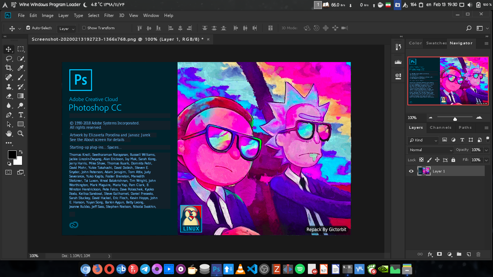

# 🚀 Complete Adobe Creative Suite on Linux - Photoshop + Lightroom CC!

<p align="center">
  
</p>

<p align="center">
  
</p>

<div align="center">

## 🔥 **NOW WITH LIGHTROOM CC SUPPORT!**

[](https://winehq.org)
[
[
[
[](https://github.com/bpawnzZ/photoshopCClinux-lightroom/stargazers)

**The most complete Adobe Creative Suite setup for Linux - Both Photoshop AND Lightroom CC!** 🎨📸

*No external downloads needed - Everything bundled locally!*

</div>

---

## ✨ **Why Choose This Repository?**

### 🔥 **COMPLETE ADOBE CREATIVE SUITE**
- **Photoshop CC v19.1.6** - Full professional editing suite
- **🆕 Lightroom CC v7.5** - Complete photo workflow management
- **Adobe Camera Raw** - RAW processing integration
- **Shared Wine Environment** - Both apps use optimized Wine prefix

### 🛠️ **ENHANCED FEATURES**
- **Smart Wine Detection** - Auto-detects wine-staging > wine64 > wine
- **Cross-Distro Compatibility** - Works on Arch, Ubuntu, Debian, Fedora, etc.
- **Intelligent Dependencies** - No redundant installations
- **User-Friendly Setup** - Clear error messages and actionable solutions
- **No External Downloads** - All ~2GB of files included locally

### 🎯 **WHAT MAKES THIS SPECIAL**
- **Lightroom + Photoshop Together** - Complete creative workflow on Linux
- **Regular Updates** - Active maintenance and bug fixes
- **Community-Driven** - Fork created to keep the project alive
- **Production-Ready** - Tested across multiple Linux distributions

---

## :sparkles: Features

| Feature | Description |
|:--------|:------------|
| :art: **Complete Suite** | **NEW!** Photoshop CC + Lightroom CC together |
| :package: **Bundled Files** | All ~2GB installers included - no downloads needed |
| :wine_glass: **Smart Wine** | Auto-detects wine-staging > wine64 > wine |
| :gear: **Auto-Setup** | Installs vcrun, atmlib, msxml automatically |
| :recycle: **Shared Prefix** | Both apps use same optimized Wine environment |
| :desktop_computer: **Launchers** | Desktop entries for both Photoshop & Lightroom |
| :camera: **Camera Raw** | RAW processing integration |
| :penguin: **Cross-Distro** | Works on Arch, Ubuntu, Debian, Fedora, etc. |

---

## 🚀 **GET STARTED NOW!** (3 Easy Steps)

### Prerequisites

**Highly Recommended:** Follow [GloriousEggroll's Wine Dependency Guide](https://www.gloriouseggroll.tv/how-to-get-out-of-wine-dependency-hell/) to properly set up Wine before running this installer!

```bash
# Arch Linux (recommended)
sudo pacman -Sy
sudo pacman -S wine-staging winetricks
sudo pacman -S giflib lib32-giflib libpng lib32-libpng libldap lib32-libldap gnutls lib32-gnutls mpg123 lib32-mpg123 openal lib32-openal v4l-utils lib32-v4l-utils libpulse lib32-libpulse alsa-plugins lib32-alsa-plugins alsa-lib lib32-alsa-lib libjpeg-turbo lib32-libjpeg-turbo libxcomposite lib32-libxcomposite libxinerama lib32-libxinerama ncurses lib32-ncurses opencl-icd-loader lib32-opencl-icd-loader libxslt lib32-libxslt libva lib32-libva gtk3 lib32-gtk3 gst-plugins-base-libs lib32-gst-plugins-base-libs vulkan-icd-loader lib32-vulkan-icd-loader cups samba dosbox

# Debian/Ubuntu
sudo dpkg --add-architecture i386
wget -nc https://dl.winehq.org/wine-builds/winehq.key
sudo apt-key add winehq.key
sudo apt-add-repository 'https://dl.winehq.org/wine-builds/ubuntu/'
sudo apt update
sudo apt install --install-recommends winehq-staging winetricks

# Fedora
sudo dnf groupinstall "Development Tools"
sudo dnf install wine winetricks
```

> **Pro Tip:** Run `./setup.sh` as the user who will use Photoshop, not as root!
>
> **Note:** The only additional step from GloriousEggroll's guide not covered above is creating a symlink:
> ```bash
> sudo ln -sf /usr/bin/wine64 /usr/bin/wine
> ```

### 🚀 **QUICK START** (Ready in 5 minutes!)

<div align="center">

**⭐ Star this repo first, then install! ⭐**

</div>

```bash
# 1. Clone the repository
git clone https://github.com/bpawnzZ/photoshopCClinux-lightroom.git
cd photoshopCClinux-lightroom

# 2. Download large files (Git LFS)
git lfs install
git lfs pull

# 3. Make executable and run
chmod +x setup.sh
./setup.sh
```

**That's it!** Choose from the menu:
- 🎨 **Install Photoshop CC**
- 📸 **🆕 Install Lightroom CC**
- 🔧 Configure Wine settings
- 🗑️ Uninstall if needed

> **💡 Pro Tip:** Install Wine first using the commands below for best results!

### Custom Paths

```bash
# Custom installation directory
./setup.sh -d /path/to/install

# With custom cache
./setup.sh -d /path/to/install -c /path/to/cache
```

---

## :floppy_disk: Included Files

| File | Size | Description |
|:-----|:-----|:------------|
| `photoshopCC-V19.1.6-2018x64.tgz` | ~1 GB | Photoshop CC v19.1.6 installer |
| `lightroomCC-V7.5-2018x64.tgz` | ~800 MB | **🆕 Lightroom CC v7.5 installer** |
| `replacement.tgz` | ~15 MB | Resource replacement files |
| `CameraRaw_12_2_1.exe` | ~480 MB | Adobe Camera Raw v12.2.1 |

**Total: ~2.3GB - Everything included, no external downloads!**

### 📋 **Installation Menu Options**
- **1.** 🎨 Install Photoshop CC
- **2.** 📸 **🆕 Install Lightroom CC** (NEW!)
- **3.** 📷 Install Adobe Camera Raw
- **4.** ⚙️ Configure Wine Settings
- **5.** 🗑️ Uninstall Applications
- **6.** 👋 Exit Setup

---

## :camera: Adobe Camera Raw (Optional)

Install via `./setup.sh` (option 2), then restart Photoshop and go to `Edit → Preferences → Camera Raw`

---

## 📸 **🆕 Adobe Lightroom CC** (Full Photo Workflow!)

> **🌟 NEW FEATURE!** Complete Lightroom Classic CC support added to this repository!

**Why Lightroom on Linux matters:**
- Professional photo editing and organization
- Non-destructive RAW processing
- Advanced color grading and retouching
- Complete photo management workflow
- **Now works alongside Photoshop CC!**

### 🚀 **Install Lightroom CC**

> **Note:** Install Photoshop first for optimal Wine prefix setup!

```bash
# Via setup menu (recommended)
./setup.sh
# Choose option 2: Install Lightroom CC

# Or run directly
~/photoshopCClinux/lightroom
```

**Lightroom will appear in your desktop applications menu after installation!**

> **Community Request:** Originally requested in [Gictorbit/photoshopCClinux#221](https://github.com/Gictorbit/photoshopCClinux/issues/221) - Now fulfilled! 🎉

---

## :wine_glass: Wine Configuration

```bash
chmod +x winecfg.sh
./winecfg.sh
```

> **Note:** Set Windows version to **Windows 7** in winecfg. Windows 10 may fail to start the applications.

### Troubleshooting GPU / Liquify

If Liquify or GPU features don't work:
1. **Edit → Preferences → Performance**
2. **Uncheck** "Use Graphics Processor"
3. Restart Photoshop

---

## :arrow_down: Uninstallation

```bash
chmod +x uninstaller.sh
./uninstaller.sh
```

---

## 🌟 **Community & Support**

### 💬 **Join the Discussion**
- **GitHub Issues:** Report bugs or request features
- **GitHub Discussions:** Share your setup experiences
- **Community Fork:** This project keeps the original alive!

### 🎯 **Perfect For:**
- **Professional Photographers** - Complete Lightroom + Photoshop workflow
- **Graphic Designers** - Industry-standard tools on Linux
- **Linux Enthusiasts** - Adobe Creative Suite without Windows
- **Students** - Free access to professional software

### 📈 **Repository Stats**
<div align="center">

**Help keep this project alive - ⭐ Star this repo! ⭐**

[](https://github.com/bpawnzZ/photoshopCClinux-lightroom/stargazers)
[](https://github.com/bpawnzZ/photoshopCClinux-lightroom/network)

</div>

---

## :heart: Credits & Acknowledgments

<div align="center">

### Original Project
**[Gictorbit/photoshopCClinux](https://github.com/Gictorbit/photoshopCClinux)**  
*The original project that made this possible*

### Why This Fork Exists
The upstream project's download links went dead. This fork keeps the project alive by including all required files locally.

</div>

---

## :book: License

This project is provided as-is for educational purposes. You must own a legitimate copy of Adobe Photoshop to use this software legally.

---

<div align="center">

## 🎉 **Ready to Get Creative?**

**Install Photoshop + Lightroom CC on Linux today!** 🚀

**⭐ Don't forget to star this repository! ⭐**

*Made with ❤️ for the Linux creative community* 🐧

---

**🔗 Quick Links:**
- [📖 Full Documentation](https://github.com/bpawnzZ/photoshopCClinux-lightroom#readme)
- [🐛 Report Issues](https://github.com/bpawnzZ/photoshopCClinux-lightroom/issues)
- [💬 Community Discussion](https://github.com/Gictorbit/photoshopCClinux/issues/221)

[](https://github.com/bpawnzZ/photoshopCClinux-lightroom/stargazers)
[](https://github.com/bpawnzZ/photoshopCClinux-lightroom/network)

</div>
